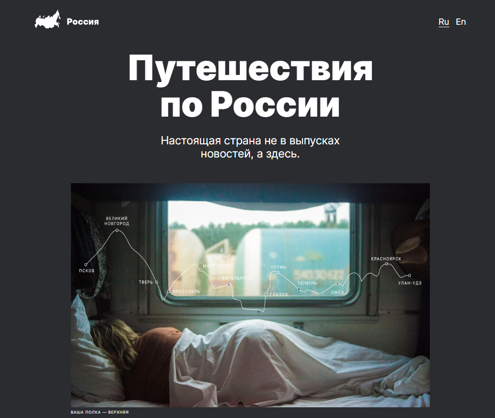

# Название проекта: **Путешествие по России**

## Описание проекта:
Сайт создан с целью ознакомления посетителей с интересными местами России, которые можно посетить, путешествуя по Транссибирской магистрали от Москвы до Байкала. На сайте добавлены изображения и активные ссылки на описание мест на страничках в интернете.
## Технологии и функциональность:
* HTML
* CSS
* Flexbox
* Адаптивная верстка для разрешений от 320 до 1280 пикселей через применение @media.
* BEM Nested
* Использованы семантические теги.
* Задано необходимое позиционирование элементов, в т.ч. использование z-index.
* Заданы правильные относительные пути к файлам.
* Использованы директивы @import.
* Ссылки активные, реагируют на курсор, затемняются при наведении.

## Планы по доработке:
* Доработка проекта до отзывчивой верстки.
* Доработка возможности изменения языка страницы Ru/En.
* Создание попапа открытия изображений страницы.

## Ссылка на дeплой проекта:
[GitHub Pages](https://kpolllka.github.io/russian-travel/)